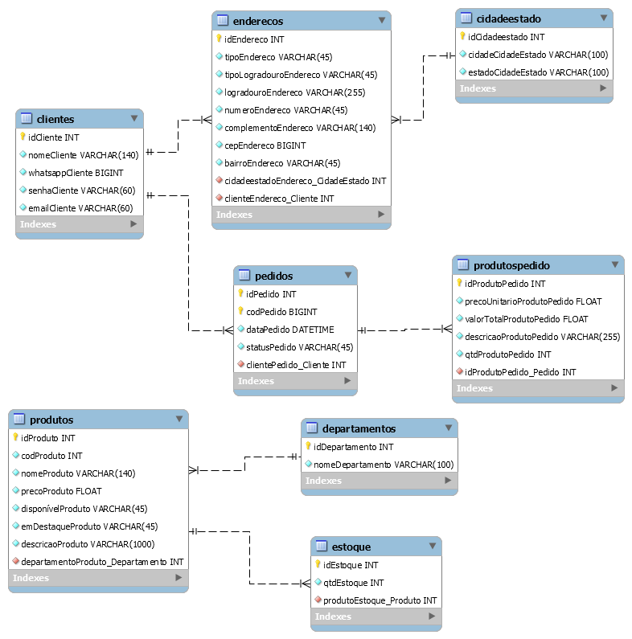

<h1 align='center'>Database em MySQL</h1>
 <h2 align='center'> <i>Instruções de uso dos arquivos do banco de dados</i></h2>

<h3 align='center'>Arquivos</h3>

<ul>
<li>minha_loja_gama_modelo.mwb - <i>Modelo de visualização das tabelas da Minha Loja Gama. </i></li>
<li>minha_loja_gama_tabelas.sql -<i>Instruções para criação das tabelas da base de dados. </i></li>
<li>minha_loja_gama_queries.sql - <i>Queries com os scripts para execução e resolução dos exercicios.</i></li>
<li>minha_loja_gama_dados.sql - <i>Instruções para inserção dos dados nas tabelas.</i></li>
</ul>
 
<h3 align='center'>Regras Gerais</h3>

<ul>
<li>As tabelas da base de dados foram criadas seguindo a regra de:</li>
<li>- O nome de cada tabela é somente com letras minúsculas e no plural (ex. <i>clientes</i>). </li>
<li>- O nome das colunas começam sempre com a informação da coluna seguido do nome da tabela no singular e com letra maiúscula (ex. <i>idCliente</i>). </li>
<li>- As colunas com Foreign Keys começam com a informação desejada da outra tabela seguida pelo nome da tabela atual, no singular e com letra maiúscula, seguido por "_" e o nome da outra tabela de onde vem a informação, no singular e com letra maiúscula(ex. <i>clienteEndereco_Cliente</i>). </li>
</ul>

 

<h3 > Modelo gráfico de entidade/relacionamento </h3>
 

